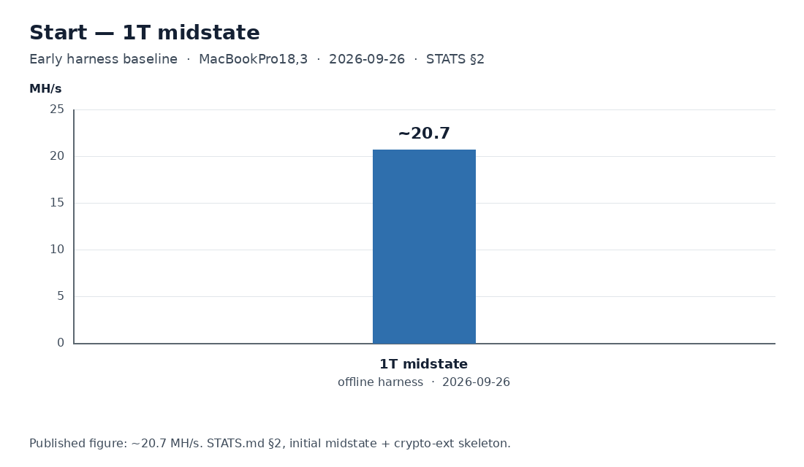
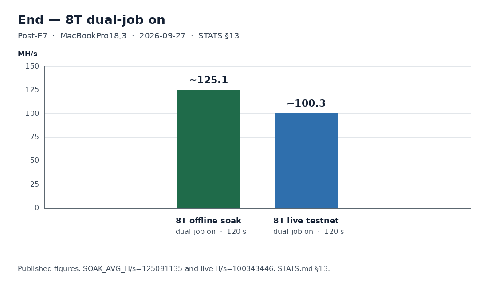

# silicon-miner

## Hash rate: start and end

MacBookPro18,3. Both charts use the published rows in [STATS.md](STATS.md).

The first recorded baseline is the early single-core midstate harness: about **20.7 MH/s**, 1 thread, offline `_sha256d_mine_midstate` (section 2, 2026-09-26).



After E7 on `main`, default 8 threads and `--dual-job on` (section 13, 2026-09-27): offline soak **125.1 MH/s** (`SOAK_AVG_H/s=125091135`, 120 s) and live tn3 **100.3 MH/s** (`100343446`, 120 s). The live bar is the per-nonce `sha256_compress` / `sha256d_asm_one` scan.



A later confirm on `main` (`8c5287f`), about 60 s with `--dual-job on`, was about **95.8 MH/s** (`early_share` 0, `underfeed` 0, share wall about 9%).

## What this is

Educational Apple Silicon (M1 / ARM64) Bitcoin SHA-256d miner. The goal is education, correctness, and using the silicon well. Profit is out of scope.

The hash path is pure ARM64 assembly and uses the crypto-extension SHA instructions (`SHA256H`, `SHA256H2`, `SHA256SU0`, `SHA256SU1`). C stays outside that path: the harness, Stratum, sockets, and JSON. The live client is bare TCP.

It connects to a public Bitcoin testnet Stratum pool (`tn3.btclab.dev`, or a similar testnet endpoint). Mainnet and paid pools stay off unless Emshon names a worker and password and says yes in chat.

v1 metrics include absolute package energy during a work window: watts, W/hash, and J/hash from `powermetrics` (`measure.sh`, needs sudo). Recorded numbers are in [STATS.md](STATS.md).

Offline soak and measure call `_sha256d_mine_midstate` (the dual-lane midstate loop). With `--dual-job on`, that same entry runs against two hot midstate slots, and C does the slot handoff. A live Stratum share scan builds the header in C, then hashes each nonce with `sha256_compress` / `sha256d_asm_one`.

**Learning only.** Testnet Stratum is the supported pool path.

## Layout (flat)

| File | Role |
|------|------|
| `sha256d_mine.s` | Pure ARM64 Crypto Extension hash path (`SHA256H` / `H2` / `SU0` / `SU1`) |
| `harness.c` | Tests, timing, metrics, CLI, testnet mine loop (no hash logic) |
| `mono_clock.h` | `TIME_SPLIT` clock: `mach_absolute_time` on macOS, `CLOCK_MONOTONIC` elsewhere |
| `stratum.c` / `stratum.h` | Bitcoin Stratum V1 client (subscribe / authorize / notify / submit) |
| `Makefile` | Build / clean / metrics / testnet |
| `measure.sh` | v1 absolute package energy (W, W/hash, J/hash via `powermetrics`; needs sudo) |
| `README.md` | This file |

## Build & run (Apple Silicon Mac)

Requires `as`/`clang` with `-arch arm64` (Xcode Command Line Tools).

```sh
make                 # builds miner_test
./miner_test         # self-test + timed batch (default)
./miner_test 5000000 # custom nonce count for H/s
./miner_test --threads 4 5000000
make clean
```

## Threads

`--threads N` splits a nonce span across N workers in C. Each worker calls `_sha256d_mine_midstate` on a disjoint range (even slices, so the asm stays on the dual-lane path). `N=1` is the original single call.

Default N is `hw.physicalcpu` (every physical core), then `hw.ncpu`, then `sysconf(_SC_NPROCESSORS_ONLN)`. On Apple Silicon that is performance cores plus efficiency cores. MacBookPro18,3 is 6 P-cores + 2 E-cores, so the default is 8. `hw.perflevel0.physicalcpu` is only the P-cores and is no longer the default. `--threads N` still overrides it.

Timing, `--metrics`, `--soak`, and the testnet loop all take `--threads`. Stratum share checks are a target inequality, so that search uses the same partition but hashes each slice with the existing asm compress (`sha256_compress` via `sha256d_asm_one`). `--metrics` prints `THREADS` and `ASM_H/s`.

## P-core pin (macOS)

Default `--pin`. `--no-pin` turns it off. There is no public API to bind a thread to a CPU index. Each mining thread does both of these:

1. QoS via `pthread_set_qos_class_self_np`. Worker slots below `hw.perflevel0.physicalcpu` use `QOS_CLASS_USER_INTERACTIVE` so the scheduler prefers performance cores. Slots at or above that count use `QOS_CLASS_UTILITY` so those workers can run on efficiency cores instead of every thread contending for the P cluster. If perflevel0 is unavailable, every worker stays on `QOS_CLASS_USER_INTERACTIVE`.
2. `thread_policy_set(..., THREAD_AFFINITY_POLICY)` with a distinct tag `1..N`. Tag 0 means no affinity. Distinct tags ask the scheduler to spread workers across L2 cache domains instead of packing them onto one core.

`--threads N` with N at or below the P-core count keeps the old all-performance-core QoS. Including the E-cores raises total H/s and can worsen W/hash (package watts per hash): the extra cores hash, and they are not as efficient per hash as the P-cores on this workload.

Startup prints `PIN=on` or `PIN=off` or `PIN=na` (Linux). `PIN_QOS_RC`, `PIN_AFFINITY_RC`, `PIN_PCORES`, and `PIN_EWORKERS` are on stderr.

## Offline soak

Sustained local hashing, no pool. Periodic H/s is the instantaneous rate since the previous line; `H/s_avg` is from the start. Use this to compare a short batch with a multi-minute run.

```sh
./miner_test --soak 60
./miner_test --soak 180 --threads 4 --report 2
```

`--soak` cannot be combined with `--testnet`. Testnet duration is still `--seconds`.

## Linux check (not an M1 bench)

The hash path is Mach-O and uses Apple `@PAGE` syntax. On Linux, `make` rewrites that syntax to ELF, cross-assembles with `aarch64-linux-gnu-gcc`, and runs under `qemu-aarch64-static -cpu max`. Self-test must pass. Any H/s from that run is qemu, not Apple Silicon.

## Bitcoin testnet mining (Stratum)

Connects to a **public testnet3** Stratum, builds headers from `mining.notify`, scans shares with per-nonce `sha256_compress` / `sha256d_asm_one`, and submits them. That live scan is the asm compress path. Offline soak and measure use `_sha256d_mine_midstate`.

```sh
# BTCLab testnet3 (default). Username must be a tb1… address (`.` is rejected).
# Uses a built-in throwaway mining-only address + mining.suggest_difficulty 0.001
# so a CPU can prove an accepted share in seconds.
make testnet
# or:
./miner_test --testnet --seconds 90 --max-shares 1 --threads 4

# Custom endpoint / user:
./miner_test --stratum tn3.btclab.dev:3333 \
  --user tb1q… --pass x --suggest-diff 0.001 --seconds 120
```

**Notes**

- Default endpoint: `stratum+tcp://tn3.btclab.dev:3333` (bare TCP, no TLS).
- BTCLab docs mention user `.` / pass `x`; in practice authorize requires a real `tb1…` address. A throwaway testnet address is fine for mining-only.
- Default mining username is throwaway testnet P2WPKH `tb1qhpe5prj25dsaxjnhq0ukj689xrcy8ede76p2up` (mining-only; not a savings wallet).
- Fallback pool `testnet3.solopool.com:3332` also accepts `tb1…` (and honors `mining.suggest_difficulty`).
- Default pool difficulty without suggest is often **16384** (~weeks at ~25 MH/s). Always pass `--suggest-diff` for CPU education runs.
- `--suggest-diff 0.001` is the default so `make testnet` can accept a share quickly. For a long H/s soak (`--max-shares 0`), that easy suggestion floods submits until the pool vardiffs (a Mac soak climbed 0.001 → 0.16). Pass `--suggest-diff 1` for a quieter soak. The miner still checks each nonce against the pool's `mining.set_difficulty` target; `mining.suggest_difficulty` is only a request.
- Hash path stays **pure asm**; C does Stratum, merkle/header setup, and share-target checks.
- While workers hash, the main thread polls the socket. A new `mining.notify` is parsed and its midstate is built into a side buffer during that hash. `clean_jobs` cancels the in-flight scan so stale work stops; a non-clean notify finishes the current batch, then switches to the already-built header. The summary field `jobs_staged_while_hashing` counts notifies staged before the batch ended.
- A worker that finds a share queues it immediately and finishes the rest of its nonce range. Siblings are not cancelled. The main thread writes `mining.submit` on the next poll (`stratum_submit_async`) and counts the reply later. A share does not roll extranonce2: the next batch continues the nonce cursor on the same header until the 32-bit nonce space wraps, a new job is staged, or `clean_jobs` cancels the scan.
- Live session note: notify parsing must fully skip long `coinb1`/`coinb2` strings before reading `version`/`nbits`/`ntime` (truncated scan previously left ntime empty → pool “Difficulty too low”).

## Dual-job (optional, default off)

On `main` since PR #13 (`8c5287f`, squash-merged 2026-09-27). `--dual-job off` is the default and keeps one live job. `--dual-job on` keeps **two hot midstate slots**. C does the slot handoff: a worker that finishes a slice claims whichever slot still has nonces, including the other header, without a join between those claims. Both slots call the same asm. Offline that entry is `_sha256d_mine_midstate`. On the testnet share scan it is `sha256d_asm_one` / `sha256_compress`, plus the same one-word target check. A live share is queued and the slice finishes; it does not roll extranonce2.

Mac results are in [STATS.md](STATS.md) section 13. qemu H/s is a correctness check, not an Apple Silicon result.

```sh
./miner_test --dual-job off
./miner_test --dual-job on
```

On stop, the two open windows are cancelled (`BATCHES` `early_clean`). Windows that were fully claimed are `full`. Treatment runs also print `DUAL_JOB mode=on` with `switches`, `underfeed`, `install_while_live`, and `idle_s`.

## Metrics

Recorded MacBookPro18,3 H/s, absolute package energy, and testnet soak: [STATS.md](STATS.md).

**No-power harness metrics** (recommended; no sudo):

```sh
make metrics
# or: ./miner_test --metrics
```

Prints `.text` size, `THREADS`, `ASM_H/s`, `CC_H/s`, and easy-target `TTFN_S`.

### Reading TIME_SPLIT

The default timed batch, `--soak`, and the testnet summary print where the wall clock went. `TIME_SPLIT_PCT` is each bucket divided by elapsed time. The six percentages add to 100.

| Field | Counts |
|-------|--------|
| `hash_s` | In-flight worker wall × the fraction of that batch spent in the asm call (`_sha256d_mine_midstate` offline, `sha256d_asm_one` / `sha256_compress` on the testnet scan) |
| `share_s` | Same in-flight wall × the fraction spent in the per-nonce C target check and the rest of the scan loop |
| `poll_s` | Main-thread `stratum_poll` while no batch is running (stalls the next hash) |
| `midstate_s` | Header and midstate build while no batch is running |
| `submit_s` | Share enqueue plus `mining.submit` writes while no batch is running |
| `other_s` | Remainder of the wall clock. `TIME_SPLIT_GAPS` splits this remainder; it is not renamed away |

`TIME_SPLIT_GAPS` is that remainder, in the same clock. The seven fields sum to `other_s`, so together with `hash` / `share` / `poll` / `midstate` / `submit` they add to 100% of elapsed wall (`TIME_SPLIT_GAPS_PCT`).

| Field | Counts |
|-------|--------|
| `batch_setup_s` | From deciding to start a batch until the **first** worker is about to enter the hash loop (nonce split, `pthread_create`, pin). Later workers' spawn delay overlaps that first worker and stays inside `flight_s` |
| `teardown_s` | From the **last** worker leaving the hash loop until `pthread_join` has collected results, plus full-batch bookkeeping before the next start. Includes the main thread still blocked in `select` after workers have already stopped |
| `share_restart_s` | Extra wall after that join when a short batch rolls extranonce2 (a slice stopped before its assignment). A share that finishes the slice keeps the header and does not add this gap. Header build and submit writes already in `midstate_s` / `submit_s` are not counted again |
| `cancel_restart_s` | Extra wall after that join when `clean_jobs` / cancel resumes work |
| `end_drain_s` | `stratum_submit_drain` after hashing has stopped (pool reply wait) |
| `status_s` | STATUS / soak printf while no batch is in flight |
| `unexplained_s` | Residual of `other_s` |

A live share is queued and that worker **finishes its slice**. Siblings finish theirs too. The batch's flight wall is still the slowest slice. `early_share` means the batch hashed fewer nonces than it was assigned because a slice stopped early (the synchronous share-scan selftest still stops at the first hit). It does not mean every worker aborted. A live soak should stay on `full` across share hits. `early_clean` means `clean_jobs` or end-of-run cancel stopped the batch short of its assignment. `full` finished the assignment, including when a share was found along the way.

`TIME_SPLIT_GAPS_DETAIL` splits the join-side part of `teardown_s` (not an extra percentage): `wake_s` is from the last worker's exit until the main thread notices the batch is done; `join_s` is `pthread_join` after that. `wake_s + join_s` is that join-side teardown, not the post-join bookkeeping also folded into `teardown_s`. While a batch is in flight the main thread `select`s on the Stratum socket and a self-pipe. The last worker writes one byte after it leaves the hash loop, so that `select` returns without waiting out the poll timeout. Socket data still wakes the same `select`, which is what keeps job staging and async submit overlapped with hashing.

`BATCHES` counts starts and how they ended, plus `avg_flight_s` (flight wall / flights) and `hashes_per_flight`.

`TIME_SPLIT_OVERLAP` is poll, midstate build, and submit that ran **while a batch was hashing**. That time is concurrent with `hash_s`, so it stays off the 100% line. `poll_busy_s` is recv plus JSON. `poll_wait_s` is time blocked in `select`. A large `poll_wait_s` with a small `poll_s` means the socket wait overlapped hashing and did not stall it. A poll that runs past the last worker's exit is still entirely in `poll_wait_s`; the post-exit tail is also in `teardown_s` / `wake_s`.

`TIME_SPLIT_CPU` sums per-slice CPU time. `hash_s` there grows with thread count and can exceed the wall clock. `TIME_SPLIT_FLIGHT` is the in-flight wall before the hash/share/submit split.

`TIME_SPLIT_CLOCK` names the clock. On macOS it is `mach_absolute_time` converted with `mach_timebase_info`. The qemu self-test uses `clock_gettime(CLOCK_MONOTONIC)`. Each worker keeps its own tick totals; the main thread adds them after join. A one-time median of an empty clock pair is removed from the testnet per-nonce samples so `share_s` tracks the C target check.

Compare an offline `--soak` (dual-lane `_sha256d_mine_midstate`) with a testnet run (per-nonce asm compress plus C target check). The H/s gap is in the buckets, which is the reason to read them before changing the scan.

**Absolute package energy (v1).** `measure.sh` samples package watts with `powermetrics` during an offline multi-thread soak (needs sudo), not a short nonce batch, so the sample is taken while hashes are in flight. Report absolute package W, `W_PER_HASH`, and `J_PER_HASH` (`J/hash = W / (hash/s)` over `SOAK_AVG_H/s`). Idle watts are context only.

```sh
./measure.sh
./measure.sh --threads 4
./measure.sh --threads 4 --seconds 20
```

## What the asm exports

| Symbol | Role |
|--------|------|
| `_sha256_compress` | One 64-byte block; state in/out |
| `_sha256d_genesis_selftest` | FIPS "abc" + genesis midstate mine; `0` = PASS |
| `_sha256d_mine_midstate` | Dual-lane midstate loop (offline soak / measure, and both dual-job slots). Next-group schedule sits under `SHA256H`/`H2`; cached midstate/IV are added in place. This paired-lane order is schedule A |

E6 tried a lane-major schedule B (`_sha256d_mine_midstate_e6b`) in PR #12. The offline 1-thread pair was flat, and the PR was closed without merge. `main` keeps schedule A.

## Where the work stands

| Item | Status |
|------|--------|
| Step 1, finish the nonce slice after a share | On `main` (PR #8, `a4ad0ba`) |
| Step 2, default threads = `hw.physicalcpu` (P-core and E-core QoS) | On `main` (PR #10, `6312feb`). Default is 8 on a 6P+2E Mac |
| E6 SHA-pipe schedule A/B | Measured flat, abandoned. PR #12 closed without merge. Prefer schedule A |
| E7 dual-job | On `main` (PR #13, `8c5287f`). Optional; `--dual-job` defaults off |

## Constraints

- Hash path is **pure ARM64 assembly** — no C in the hash path
- C is the harness, Stratum, sockets, and JSON
- Mainnet and paid pools stay off unless Emshon names a worker and password and says yes in chat
